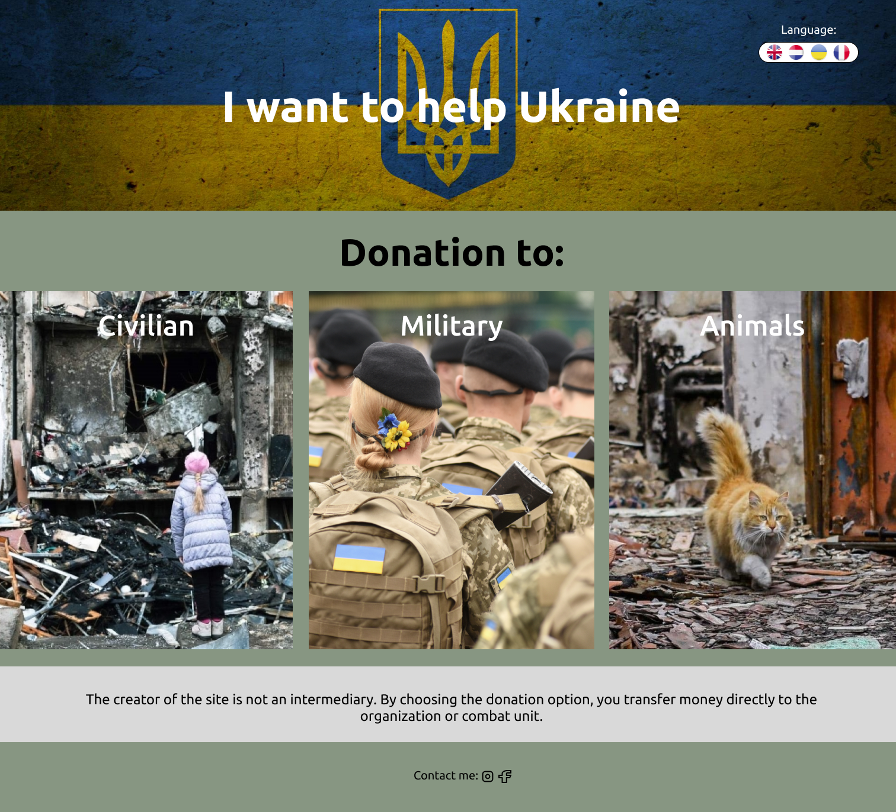

# Individual project

## Wireframe

<!-- ## User Story Dependencies

[Story Dependency Diagram](https://excalidraw.com/)

---

## WIREFRAME

 -->

---

## 0.Setup

- Boilerplate HTML file
- Page title in the HTML file
- Empty CSS file
- CSS file is linked to HTML

## 1. Title with background image

- The title and all Home page is developed on branch `create`.
- This branch is merged to `master` branch after completion.
- There is background image under the title.
- There are language options in the upper right corner.

## 2. Donation section

- There are three buttons in the form of images to go to pages with a
  description and details for donations.

## 3. Author comment section

- The `section` is a different color than the background, with a small comment
  from the author.

## 4. Footer

- Contact with author - facebook and instagram signs like links
